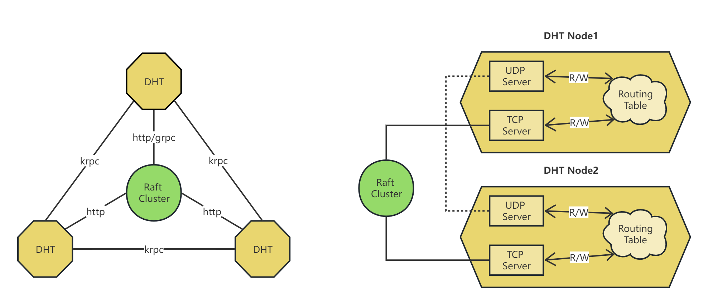

This is a fork of golang Kademlia/Bittorrent [DHT library](https://github.com/nictuku/dht) that implements [BEP5](http://www.bittorrent.org/beps/bep_0005.html).

To improve DHT's avalibility, we build each DHT node a http server to accept peer routing information. It can also cooperate with a ETCD cluster that act as an external coordinator.

A DHT node already has a UDP server to handle [peer routing](routingTable/routing.go), and has a [routing table](routingTable/routing_table.go) to store its peers. A DHT node use [krpc](remoteNode/krpc.go) (which is introduced by BEP5) to interact with other DHT nodes.

The DHT performs well and supports the most important features despite its simple API.
Besides, the security of a DHT overlay network can be significantly imporved.

A full example is at:
[find_infohash_and_wait](examples/find_infohash_and_wait/main.go)

